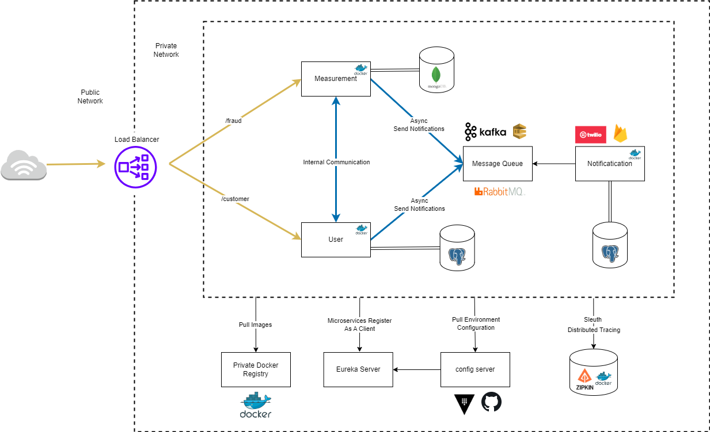

## Challenge 6: Routing, cross-cutting concerns in microservices

### Problem

##### 1. How do we maintain a single entry point into microservices network?

Làm thế nào để chúng ta xây dựng một **single gatekeeper** cho tất cả lưu lượng vào microservices.
Bằng cách này, client không cần phải theo dõi các dịch vụ khác nhau liên quan đến một transaction, đơn
giản hóa logic của client.

##### 2. How do we handle cross cutting concerns?

Trong một kiến trúc microservices phân tán, làm thế nào để chúng ta đảm bảo việc thực thi nhất quán
các **cross cutting concerns** như logging, auditing, tracing và security trên nhiều microservices.

##### 3. How do we route based on custom requirements?

Làm thế nào để cung cấp khả năng **dynamic routing** cho phép định nghĩa các quy tắc định tuyến dựa
trên các tiêu chí khác nhau như **HTTP headers**, **request parameters**, v.v. trong microservices?

### Solution

These challenges in microservices can be solved using an `Edge server`

##### Few important tasks that API Gateway does
- Request Validation
- Include & Exclude list
- Authentication and Authorization
- Rate Limiting
- Dynamic Routing
- Server Discovery
- Modify Request/Response
- Protocol conversion

##### Spring Cloud Gateway

